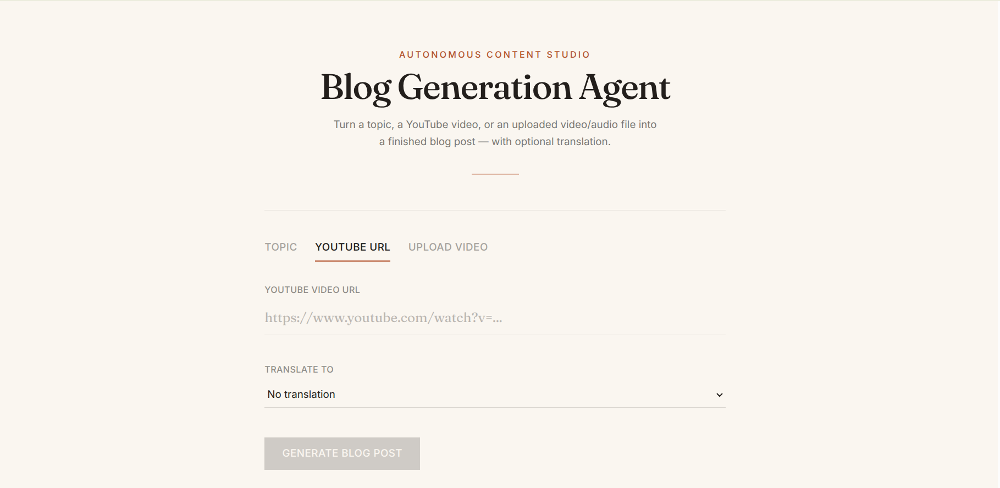

# Autonomous Blog Generation Agent

<!-- screenshot -->
<!--  -->

Turns a topic, a YouTube URL, or an uploaded audio/video file into a blog post, with optional
translation. Generation logic is a LangGraph DAG, served through FastAPI, with a React frontend.



## Pipeline

```
START
  ├─ (youtube) ─▶ fetch_transcript ─▶ brainstorm_titles ─▶ generate_content ─┬─ (target_language) ─▶ translate ─▶ END
  └─ (topic)   ───────────────────▶ brainstorm_titles ─▶ generate_content ─┘
                                                                            └─ (no translation) ─▶ END
```

- **fetch_transcript** — resolves a YouTube URL to a video ID and pulls its transcript (`youtube-transcript-api`), truncated to `max_transcript_chars` (default 8000).
- **brainstorm_titles** — Groq call at `temperature=0.9`, structured output, returns 3-5 candidate titles plus a selected best one.
- **generate_content** — Groq call at `temperature=0.5`, writes the full Markdown body for the selected title.
- **translate** — only runs if `target_language` is set and supported. Groq call at `temperature=0.2`, structured output, translates title + body in one shot while keeping the Markdown structure intact.

State is one shared `TypedDict` (`app/graph/state.py`) that nodes read from and partially update —
`raw_input`, `transcript`, `titles`, `selected_title`, `blog_content`, `target_language`,
`translated_title`/`translated_content`, plus `error`/`error_stage`.

Nodes don't raise on failure — they set `error`/`error_stage` on the state instead, and a routing
function right after each node checks for that and jumps straight to `END` if something went
wrong. LLM calls are wrapped so rate limits get their own `error_stage` (e.g.
`generate_content_rate_limited`), separate from other failures — the API layer maps each stage to
the right HTTP status (422/404/502/503) instead of a blanket 500.

Uploaded audio/video files skip the graph entirely: `POST /transcribe-upload` sends the file to
Groq's hosted Whisper (`whisper-large-v3-turbo`), and the resulting transcript gets resubmitted to
`/generate` as a normal `topic` input.

## Stack

Backend: Python 3.12, FastAPI, LangGraph, LangChain (`langchain-groq`), Groq
(`llama-3.3-70b-versatile` for text, `whisper-large-v3-turbo` for transcription),
`youtube-transcript-api`, Pydantic / `pydantic-settings`, LangSmith (optional tracing), Pytest.

Frontend: React 18 + Vite, Tailwind CSS, `react-markdown`.

## Project structure

```
app/
  api/routes.py          /generate, /transcribe-upload, /languages, /health
  config.py              Groq key/model, supported languages, LangSmith config
  graph/
    builder.py            DAG construction
    nodes.py              node implementations + routing
    state.py              shared graph state
  models/schemas.py       request/response models
  services/
    llm.py                 Groq chat model factory
    youtube.py              URL parsing + transcript fetching
    transcription.py        Whisper transcription
frontend/src/             App.jsx, api.js, components/
tests/                    offline test suite (mocked LLM + transcript fetch)
```

## Setup

```bash
python3 -m venv .venv && source .venv/bin/activate
pip install -r requirements-dev.txt   # or requirements.txt for runtime-only
cp .env.example .env   # set GROQ_API_KEY (free tier: console.groq.com)
```

```bash
cd frontend && npm install
cp .env.example .env   # VITE_API_BASE_URL defaults to http://127.0.0.1:8000
```

## Running

```bash
uvicorn app.main:app --reload      # http://127.0.0.1:8000/docs
cd frontend && npm run dev         # http://localhost:5173
```

## API

```bash
curl -X POST http://127.0.0.1:8000/generate \
  -H "Content-Type: application/json" \
  -d '{"input_type": "topic", "content": "The history of coffee"}'

curl -X POST http://127.0.0.1:8000/generate \
  -H "Content-Type: application/json" \
  -d '{"input_type": "youtube", "content": "https://youtu.be/VIDEO_ID", "target_language": "french"}'

curl -X POST http://127.0.0.1:8000/transcribe-upload -F "file=@/path/to/clip.mp3"
```

`GET /languages` — supported translation targets. `GET /health` — liveness check.

| Failure | Status |
|---|---|
| Malformed YouTube URL | 422 |
| Transcript disabled / not found | 422 |
| Video unavailable / private | 404 |
| YouTube blocked the request | 503 |
| Unsupported `target_language` | 422 |
| Empty / oversized file upload | 422 / 413 |
| Groq API error | 502 |
| Groq rate limit | 503 |
| Unexpected pipeline failure | 500 |

## Testing

```bash
pytest -q
```

Runs fully offline (mocked LLM + transcript fetch via `tests/conftest.py`). To hit the real Groq
API and a real YouTube video, set `GROQ_API_KEY` and use `/generate` directly.
